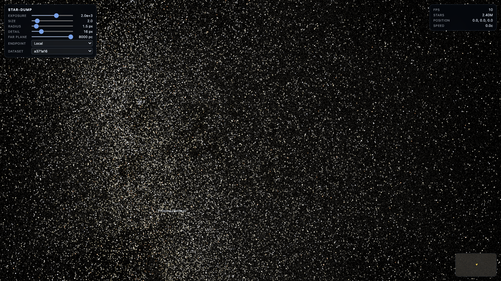

# StarDump

A system for ingesting, indexing, serving, and visualizing the [Gaia DR3](https://www.cosmos.esa.int/web/gaia/dr3) star catalog in 3D space. Gaia DR3 is the third data release from the ESA Gaia mission and contains astrometry, photometry, and spectra for roughly 1.8 billion sources.

The pipeline consists of:

1. **Ingestion** — stream Gaia bulk CSV.GZ files into a compact canonical binary format
2. **Index build** — pack canonical data into a spatially indexed `starcloud.bin` octree with precomputed LOD subsamples
3. **Query API** — serve the index over HTTP with radius queries and byte-range streaming
4. **Viewer** — WebGL interactive star viewer that streams LOD nodes on demand
5. **Offline renderer** — render stills and video from a local dataset, with no browser

The viewer and the offline renderer are one renderer. `core/` holds everything
both need — the octree, the level-of-detail cut, the streaming cache, the
camera, the splat shaders — and the two sides differ only in how they reach the
point table and how they decide a frame is finished. `viewer/src/` is the page
around it; `offline/` is the Node side and the tour.

Data references:
- [Gaia DR3 overview](https://www.cosmos.esa.int/web/gaia/dr3)
- [Gaia source table schema](https://gea.esac.esa.int/archive/documentation/GDR3/Gaia_archive/chap_datamodel/sec_dm_main_source_catalogue/ssec_dm_gaia_source.html)

## Technical notes

**Coordinate system** — Stars are stored in Sun-centered ICRS Cartesian coordinates in parsecs. RA and declination from Gaia are converted using the parallax distance `d = 1000 / parallax_mas`:

```
x = d · cos(dec) · cos(ra)
y = d · cos(dec) · sin(ra)
z = d · sin(dec)
```

The index covers a cube of ±4000 pc centered on the Sun, corresponding to a sphere of radius ~2000 pc for well-measured stars.

**Quality filter** — Only stars with a reliable parallax are included. The quality metric is `parallax / σ_eff`, where `σ_eff` is the larger of the reported `parallax_error` and a brightness-dependent reference floor derived from Gaia DR3 median uncertainties (0.025 mas at G ≤ 15, interpolated to 1.3 mas at G = 21). The default threshold is **10**, meaning the parallax must be at least 10× its effective uncertainty. This leaves ~1.47 billion stars.

**LOD subsampling** — The octree index precomputes a subsample at each interior node using flux-conserving selection: K=256 points per node are chosen, and their luminosity is boosted proportionally to the number of descendants they represent. This allows the viewer to render approximate images at any zoom level without loading all leaves.

Leaves have no subsample: they are drawn whole or not at all. At the default depth of 7 a leaf is a 62 pc cube holding as much as 50 000 stars, so any view from inside a kiloparsec or two is dominated by whole leaves rather than by subsamples — the level-of-detail cut for the Sun's neighbourhood comes to 5–18 million points depending on which way the camera looks. The viewer's point budget is what caps that, and a budget below the cut makes the cut depend on view direction, which shows up as detail swinging as the camera turns. A deeper index, or leaf points ordered so that a prefix is a fair sample, is what would fix it properly.

**Rendering** — Each star is projected onto the image plane and splatted as a Gaussian whose width grows with the *logarithm* of its screen brightness, the way a chart sizes a star by magnitude. Brightness runs over five decades within a single frame — a star half a parsec away against the field behind it — so anything proportional either leaves the near ones no bigger than the far ones or turns the whole sky into discs. What is seen of a star is not its width but the disc out to where its tail crosses the white point, which is why the sprite has to span five standard deviations: any less and that disc is clipped into the square it is drawn on. Flux falls off with distance squared. Colors are derived from the Gaia BP−RP color index. The HDR accumulation buffer is tone-mapped with a Reinhard curve and gamma-corrected (γ = 2.2) before writing to PNG.

The shaders are GLSL ES 1.00 on WebGL 1.0, which is not the browser's ceiling but Node's: headless-gl is WebGL 1.0 and the WebGL2 bindings for Node are unmaintained, so the viewer came down to meet the offline renderer rather than keeping a second copy of the splat maths. The accumulation target picks half float where the context offers it, which browsers do and headless-gl does not, and full float otherwise.

## Prerequisites

- [Rust](https://rustup.rs/) (Cargo) for the backend binaries
- [Node.js](https://nodejs.org/) 18 or newer for the viewer and offline renderers
- [ffmpeg](https://ffmpeg.org/) for image conversion, captions and video encoding

## Generating the data

### Step 1 — Ingest Gaia CSV files into canonical format

The `ingest` binary reads Gaia bulk CSV.GZ files and writes a compact 32-byte-per-row canonical binary format (`source_id`, RA/Dec, parallax, G magnitude, BP−RP color).

```bash
cargo build --release --bin ingest

cargo run --release --bin ingest -- \
  --input /path/to/GaiaSource_000000.csv.gz \
  --input /path/to/GaiaSource_000001.csv.gz \
  --output-root ./data
```

Repeat `--input` for each bulk file. Output lands in `./data/canonical/<range>/`. Each source file is identified by its MD5 checksum so reruns skip already-ingested files automatically.

For the full Gaia DR3 dataset on Google Cloud Run, use the Python orchestration CLI:

```bash
python3 -m stardump ingest start    # fetch manifest, upload inputs.txt, launch Cloud Run job
python3 -m stardump ingest status   # check progress
```

### Step 2 — Build the starcloud.bin index

Once canonical files are ingested, build the packed octree index:

```bash
cargo build --release --bin build-starcloud

cargo run --release --bin build-starcloud -- \
  --data-root ./data/<dataset-name>
```

Replace `<dataset-name>` with the directory name created under `./data/` during ingestion (it is the MD5 of the sorted input URL list). The output is `./data/<dataset-name>/starcloud.bin`, a single binary file containing a fixed header, octree node table, and point table with precomputed LOD subsamples.

On Cloud Run:

```bash
python3 -m stardump ingest build-index
```

## Downloading starcloud.bin from a remote API instance

The query API supports HTTP Range requests on the `/starcloud/<dataset>` endpoint, so you can stream the full index file from a running instance:

```bash
DATASET=8fbfbc19d3f4d71f76b76fef607d4dfb
API=https://star-dump-query-api-494247280614.europe-west1.run.app

mkdir -p ./data/$DATASET
curl "$API/starcloud/$DATASET" -o ./data/$DATASET/starcloud.bin
```

To list available datasets on the remote instance first:

```bash
curl "$API/indices"
```

## Running the query API

```bash
cargo run --release --bin query-api -- \
  --data-root ./data \
  --bind 127.0.0.1:3000
```

The API exposes:

| Endpoint | Description |
|---|---|
| `GET /health` | Liveness check |
| `GET /indices` | List available dataset names |
| `GET /starcloud/<name>` | Stream the full binary index (supports Range) |
| `GET /query/<name>/radius?x=&y=&z=&r=` | Radius query, returns CSV (`x,y,z,source_id`) |

Example query — all stars within 25 pc of the Sun:

```bash
curl 'http://127.0.0.1:3000/query/8fbfbc19d3f4d71f76b76fef607d4dfb/radius?x=0&y=0&z=0&r=25'
```

## Running the viewer locally

```bash
npm -C viewer/ install
npm -C viewer/ run dev
```

Open [http://localhost:8000](http://localhost:8000) in a browser. By default it
connects to `http://127.0.0.1:3000`; a running query API is required.
`?api=<url>` and `?dataset=<name>` override the endpoint and the dataset.

The query API also serves the viewer itself, from `--viewer-root` (`viewer` by
default), which is how the deployment runs: build the bundles with
`npm -C viewer/ run build` and open the API's own root. Served that way the
page is same-origin with the data it streams, so the byte-range requests need
no cross-origin preflight.

Fly with **W/A/S/D**, hold **shift** to accelerate, roll with **Q/E**, and
click the canvas to capture the mouse for looking around. The panel on the
left tweaks exposure, splat size and radius, the level-of-detail threshold, the
point budget, the field of view and the far plane; the minimap shows where in
the galactic plane the camera sits,
and named stars from the dataset's `labels.json` are drawn as they come close.

A worker owns the octree and does the level-of-detail work off the render
thread. Each pass refines the tree greedily, largest screen footprint first,
skipping anything outside the view frustum and stopping once the point budget
is spent, so how much reaches the GPU does not depend on where the camera is.
Wanted nodes that are already adjacent in the point table are fetched as one
byte range and uploaded verbatim as one vertex buffer, which keeps streaming
free of any repacking. Buffers nobody wants any more are freed
least-recently-wanted first once the memory budget is exceeded. A node stands
in for its subtree only where the subtree has nothing to show yet, which is
what makes a region appear coarse and then sharpen; a subtree that is merely
incomplete keeps the detail it has, because standing in for it would throw
away every sibling that had already arrived.



## Offline renderer

`offline/` runs the viewer's renderer under Node, with no browser and no
display. It needs one dependency, [headless-gl](https://github.com/stackgl/headless-gl):

```bash
npm -C offline/ install
```

What it changes about the viewer is two things and nothing else: the GL context
comes from headless-gl instead of a canvas, and the shaders are read off disk
instead of inlined by the bundler. Even the transport is shared — `fetch` is
global in Node 18, so `--url` streams byte ranges from a query API exactly as
the browser does, and a local dataset is the same `ReadRange` backed by a
positioned file read.

Everything that makes the picture is shared, which is why the shaders are GLSL
ES 1.00: headless-gl is WebGL 1.0 and there is no usable WebGL2 in Node, so the
viewer came down to meet it rather than keeping a second copy of the splat
maths. Settings come from the viewer's own `DEFAULT_SETTINGS`, so a render and
the page agree without anything being tuned twice.

The third difference is not code but policy: the offline renderer blocks until
every node of the cut is resident and then draws once, where the viewer draws
what has arrived and refines over later frames. Same cut, same cache, opposite
scheduling.

```bash
# The shared renderer, local index, 1920x1080
sh sh/render.sh --mode fast --dir -0.055,-0.873,-0.484 --output renders/still.png

# Same, streaming from a running query API
sh sh/render.sh --mode fast --url http://127.0.0.1:3000 --output renders/still.png

# Aimed at a labelled star, from 1.1 pc away, at a 35 degree field of view
sh sh/render.sh --mode fast --at "Barnard's Star" --eye 0,-1.1,0.1 --fov 35 \
  --output renders/barnard.png

# The CPU reference: every leaf, no level of detail, no GPU
sh sh/render.sh --mode exact --width 960 --height 540 --output renders/exact.png
```

`--output` writes P6 directly, which is what `render-check/compare.ts` reads,
and hands anything else to ffmpeg. `--exposure`, `--size`, `--radius`,
`--detail`, `--budget`, `--fov` and `--far` override the defaults; the dataset
defaults to the first one under `./data/`.

### Checking it against the viewer

Since both sides run the same shaders on the same cut, the offline renderer can
be measured against a browser screenshot of the viewer at the same camera. At
960x540 on the defaults, all 135 tiles come in under an RMSE of 0.05 and the
worst is 0.036. Total flux runs about 9% high, which is point sprite coverage
rounding between the two GL implementations rather than anything shared: at a
splat radius of 6 px, where a sprite spans 13 px instead of 4, the same
measurement falls to 1.9%.

`render-check/` holds the CPU reference that measurement is anchored to:
`brightness.ts` rasterizes the same splat in TypeScript and `render-exact.ts`
draws every leaf with no level of detail at all. That duplication is deliberate.
Its LOD renderer is gone, though — it walked the octree a second time on the CPU
to produce the same picture the shared renderer now produces on the GPU.

## Rendering a tour

`offline/render.ts` renders a contiguous run of frames of a camera tour into
one H.264 segment, and `offline/video.ts` splits a whole film across processes
and joins the segments without re-encoding.

```bash
# Sketch: 640x360, coarse, a couple of minutes
npx tsx offline/video.ts --dataset f236745 --sketch

# Full size
npx tsx offline/video.ts --dataset f236745 --jobs 2
```

A full render draws every node the level of detail asks for and waits for all
of it: the point budget is set above the largest cut a 1080p frame wants, which
is 53.9M points looking into the galactic centre, so it never truncates one.
Raising the level-of-detail threshold barely moves that — 50M at 28 px against
54M at 16 px — because the cut is dominated by leaves, and a leaf has no
subsample to stand in for it and so is always taken whole.

50M points is a gigabyte of vertex buffers, which is why a full render runs one
job by default: two alongside each other put an 8 GB machine into swap hard
enough to stall both. One job holds steady at 1.3 frames a second on the
densest frames, about 45 minutes for the film. Sketch frames are a ninth the
size and parallelise happily.

Encoding a star field is its own problem — it is nearly all fine detail, so it
compresses badly and artefacts show. The setting that matters is not the
obvious one. A star is one pixel and its colour is the whole of what it
carries, so 4:2:0 chroma, which averages colour over 2x2, costs real fidelity;
meanwhile the chroma planes of a mostly black frame are almost free to code at
full resolution. Measured over 60 frames of the rush against the raw renderer
output:

| | size | PSNR |
|---|---|---|
| crf 19, medium, 4:2:0 | 11.7 MB | 37.6 dB |
| crf 12, slow, 4:2:0 | 27.4 MB | 44.2 dB |
| crf 12, slow, 4:4:4 | 27.2 MB | 45.1 dB |
| crf 12, slow, 4:4:4 10-bit | 26.9 MB | 45.4 dB |
| HEVC crf 12, slow | 30.6 MB | 45.5 dB |

4:4:4 is both smaller and better, twice over, and HEVC does not make the
difference back. The default is still 4:2:0 because 4:4:4 will not open in
QuickTime, Safari or Chrome; `--pix-fmt yuv444p10le` is the master if you are
watching in VLC or mpv. `--crf` and `--preset` are there too.

Contiguous is what matters. Starting Node, opening the index and compiling the
shaders costs about a second, and consecutive frames want almost the same
nodes, so a process that keeps its streaming cache warm across a thousand
frames is far ahead of one that renders a frame and exits. A three minute
sketch takes about a minute across three jobs.

`offline/caption.ts` draws a star's name with ffmpeg — which has to be here for
the video anyway, and brings a real typeface with it — and adds it to the
picture rather than blending it over, so no alpha channel has to survive the
round trip.

`offline/rotation.ts` is what makes a camera move read as one flow rather than
as a sequence of moves. Holding a star while orbiting it turns the camera at
the orbit rate; swinging onto the next star turns it at whatever the swing
asks. Slerping between the two leaves at whatever rate its endpoints imply, so
the join jolts however smoothly the orientations are interpolated. A cubic on
the quaternion sphere, control points one third of the span along each end
tangent, matches angular velocity as well as orientation, and the join
disappears.

`offline/tour.ts` is the film itself: a flight through the Sun's neighbourhood
visiting every star in the dataset's `labels.json`, in two phases and one flow
through both. In a **showcase** the camera orbits a star from 0.3 pc at 3
degrees a second with the star pinned dead centre, so it becomes the one thing
in the frame that does not move while everything within a few parsecs slides
behind it. In a **transition** it flies to the next star and swings onto it.
Both phases move and turn at once, so there is parallax throughout, and a
transition leaves and arrives at exactly the rate the orbits either side of it
are turning, so nothing jolts on the way in or out.

Transitions are paced by speed rather than by duration — a transition lasts as
long as its distance needs — and the route is chosen so that the turns fall
where there is room to make them. At a fixed speed the turn a leg asks for per
parsec *is* the turn rate it demands, so ordering the stars is the whole game:
visiting the neighbours nearest first, the obvious route, is the worst of all
720 orderings on that measure, asking 79 degrees per parsec against the 28 of

    Sun, Barnard's Star, Tau Ceti, 61 Cygni A, Proxima Centauri,
    Epsilon Eridani, 51 Pegasi

which is what this uses. Insisting on the 51 Pegasi finale costs almost
nothing: the best ordering ignoring the ending manages 26.

The two ends obey different rules again, which is the other thing matching
angular velocity across a join buys — it lets three unlike things read as one
flow.

The **intro** only turns. The camera stands at the Sun and spins at 2 degrees a
second with no translation whatsoever, while the picture comes up from black on
the exposure, so the stars emerge brightest first rather than the whole frame
being turned up. The axis is derived rather than chosen, because two things
have to land at once: it sits 9 degrees below the direction the camera ends up
aimed, which puts the one point of sky a turn leaves alone just below the
middle of the frame — without that on screen there is nothing to see the turn
against and the shot reads as a drift — and the turn is wound backwards from
its end, so it finishes pointing exactly where the tour sets off whatever its
rate or duration. The Sun is where the intro stands, not something it shows, so
the tour proper starts at the first star.

The **outro** only accelerates, and has no transition into it at all. It picks
the last showcase up exactly where that leaves off — same place, same velocity,
same orientation still turning at the same rate — and opens the throttle, cubic
in time, 800 pc in thirteen seconds. Which way it runs is free, since the swing
onto a heading costs nothing, and it matters: the line the camera happens to be
looking down leaves the galactic disc, and 800 pc along it the field has visibly
thinned. Flattening that line into the plane costs 22 degrees of swing and buys
a field that never thins, so no edge of the catalogue is ever in frame.

The picture comes up and goes down on the **exposure** rather than on the
finished frame, so stars come out of the black brightest first, the way they do
at dusk, instead of the whole image being turned down at once.

The film look is the viewer's own `DEFAULT_SETTINGS`, at full size, so a render
and the page agree without anything being tuned twice. A sketch is the one
thing that cannot: a ninth of the pixels means nine times as many stars land in
each, and its coarser level-of-detail threshold takes some of that back by
drawing a third as many. It carries an exposure of its own for that, in
`video.ts`, chosen by matching a sketch frame against the full size render of
the same view. It is the one way a sketch does not preview the final.

```bash
npm -C offline/ test
npm -C offline/ run check    # typecheck
```

## Author
Samuel Carlsson & Claude
